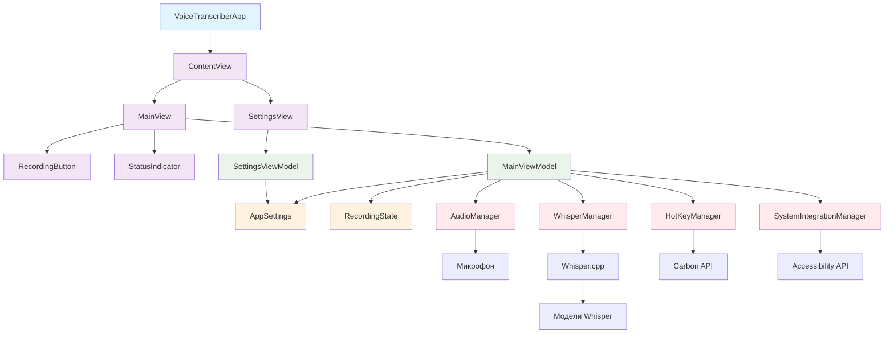

# Архитектура VoiceTranscriber

## Общая архитектура

VoiceTranscriber следует архитектуре MVVM (Model-View-ViewModel), которая обеспечивает четкое разделение ответственности между компонентами пользовательского интерфейса, бизнес-логикой и данными.

## Диаграмма архитектуры

## Описание компонентов

### Уровень приложения (App Layer)
- **VoiceTranscriberApp**: Точка входа в приложение, инициализирует основные компоненты
- **ContentView**: Главный контейнер, который отображает основной интерфейс

### Уровень представления (View Layer)
- **MainView**: Основной интерфейс с кнопкой записи, индикатором состояния и полем результата
- **SettingsView**: Окно настроек приложения
- **RecordingButton**: Кастомная кнопка записи с анимациями
- **StatusIndicator**: Визуальный индикатор состояния приложения

### Уровень ViewModel
- **MainViewModel**: Основная логика UI, управление состояниями и координация между менеджерами
- **SettingsViewModel**: Логика управления настройками приложения

### Уровень модели (Model Layer)
- **AppSettings**: Модель настроек приложения с сохранением между сессиями
- **RecordingState**: Перечисление состояний записи

### Уровень менеджеров (Manager Layer)
- **AudioManager**: Управление записью аудио через AVAudioEngine
- **WhisperManager**: Интеграция с whisper.cpp для транскрипции
- **HotKeyManager**: Регистрация и обработка глобальных горячих клавиш
- **SystemIntegrationManager**: Автоматическая вставка текста через Accessibility API

## Поток данных

1. Пользователь взаимодействует с View компонентами (MainView, SettingsView)
2. View компоненты передают действия в соответствующие ViewModel
3. ViewModel обрабатывает бизнес-логику и координирует работу менеджеров
4. Менеджеры взаимодействуют с системными API и внешними библиотеками
5. Результаты обработки передаются обратно через ViewModel в View для отображения

## Преимущества архитектуры

- **Разделение ответственности**: Каждый компонент имеет четко определенную роль
- **Тестируемость**: ViewModel могут быть протестированы независимо от View
- **Поддерживаемость**: Изменения в одном слое минимально влияют на другие слои
- **Масштабируемость**: Новые функции могут быть добавлены с минимальными изменениями в существующем коде